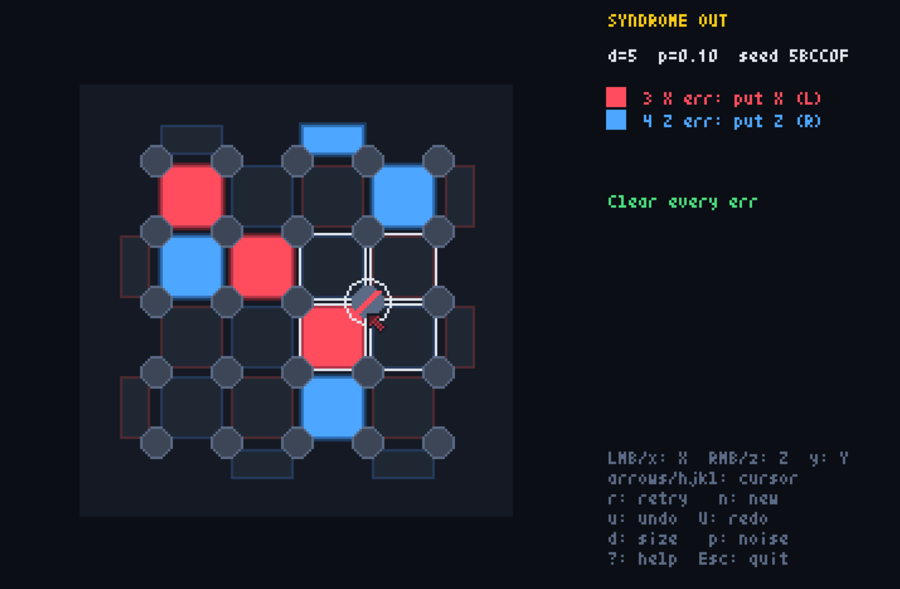
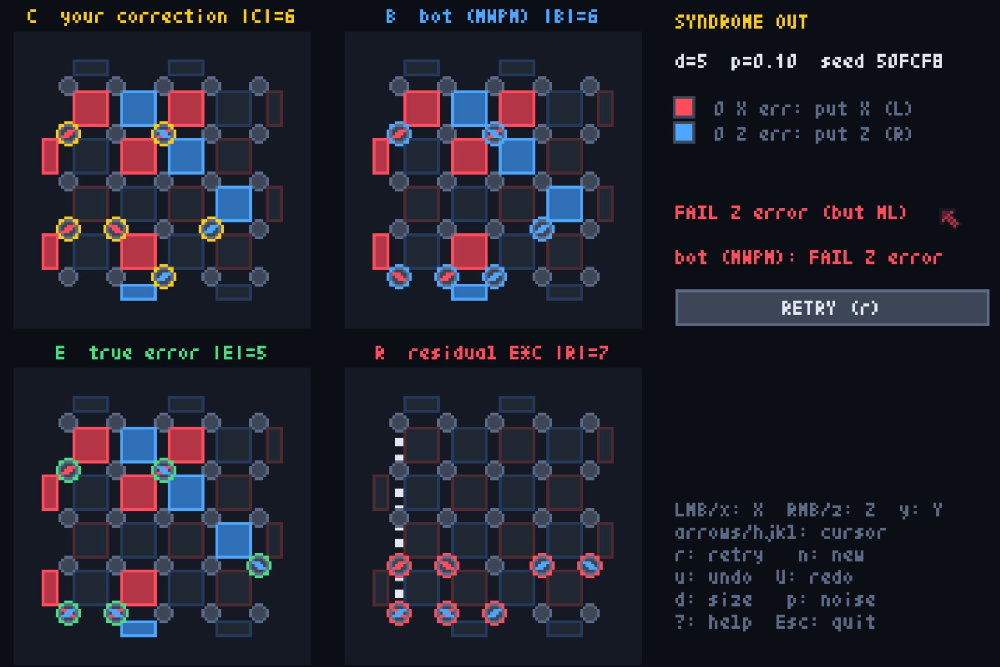

# Syndrome Out



[](https://stn.github.io/SyndromeOut/)

Lights Out for the rotated surface code. Clear every lit stabilizer face by placing
X / Z corrections on data qubits, then find out whether your correction caused a
logical error.

```
uv sync
uv run syndrome-out            # play (d=5, p=0.10 by default)
uv run syndrome-out -d 9 -p 0.15 --seed 42
uv run syndrome-out 80002A         # replay a board: the seed shown in game also fixes d and p
uv run pytest                  # acceptance tests
uv run scripts/threshold_sim.py
```

## Controls

A red tile means an X error sits next to it: clear it with X (red mark). A blue tile means
a Z error: clear it with Z (blue mark). The panel legend shows how many of each are lit.

| Input | Action |
|---|---|
| left click / `x` | toggle X on the qubit under the mouse / cursor |
| right click / `z` | toggle Z |
| `y` | toggle Y (X and Z) |
| arrows / `hjkl` | move the keyboard cursor |
| Enter or JUDGE button | judge (only when every tile is dark) |
| `u` / `U` (or Ctrl+Z / Ctrl+Y) | undo / redo |
| `r` / `n` | retry the same seed / new random seed |
| `d` / `p` | cycle distance 3-5-7-9 / error rate 0.05-0.10-0.15 |
| `?` | help, including the difference from Lights Out |

After judging, the board area splits into a 2x2 grid showing your correction C (yellow),
the bot's correction B (blue), the true error E (green) and the residual R = E*C (red)
side by side. Qubit marks are drawn along the faces they flip.

The verdict also says how your guess compared with the most likely class, i.e. the class
with the largest total probability summed over every error consistent with the syndrome
(degeneracy-aware). SUCCESS (but not ML: Z) means you were right, but the class a logical Z
away (likewise X or Y) was likelier, so the same reasoning would fail on most boards that
look like this. FAIL Z error (but ML) means you picked the most likely class and it was
wrong: the board was a losing one, not your reasoning. A NOT OPTIMAL tag under a success
means a lighter successful correction is known. The bot's line shows how the minimum-weight
correction B fared on the same board.

## Decoder

The bot and the ML verdict come from one pure-Python frontier sweep (`syndrome_out/decoder.py`).
Data qubits are visited in row-major order; the DP state is the parity of
every stabilizer face that has been opened but not yet closed, plus one bit for the logical
class, and a face is checked against the syndrome when its last qubit is passed. At d=9 the
frontier holds at most 7 faces, so a sweep touches a few hundred states and takes about 3 ms.
One pass yields, per logical class, the minimum weight with a witness and the sum of r^|E|
over all consistent errors (r = q/(1-q), q = 2p/3). For the surface code the minimum-weight
witness is what minimum-weight perfect matching finds, so PyMatching is not needed; X and Z
errors are decoded independently, as MWPM does.

`uv sync --extra mwpm` installs PyMatching as a reference. When it is importable the bot's
correction comes from PyMatching instead and the panel says `bot (MWPM)`; the extra also
enables `tests/test_decoder_vs_pymatching.py` and `scripts/threshold_sim.py --decoder pymatching`.

## Packaging

```sh
uv run pyxel package syndrome-out syndrome-out/main.py   # -> syndrome-out.pyxapp
uv run pyxel play syndrome-out.pyxapp                    # player needs pyxel and numpy
uv run pyxel app2exe syndrome-out.pyxapp                 # -> dist/syndrome-out/ (PyInstaller, dev group)
```

The runtime dependencies are just pyxel and numpy, so the `.pyxapp` runs anywhere with
`pip install pyxel numpy`, and the exe folder is about 64 MB.

As a bonus, both dependencies exist in Pyodide, so the same code also runs in a browser:
`uv run scripts/build_web.py` writes `dist/web/index.html` (via `pyxel app2html`, plus numpy
in the page's package list; Pyxel, Pyodide and numpy are fetched from CDNs at load time).
Try it with `python -m http.server -d dist/web`.

The browser version is published at <https://stn.github.io/SyndromeOut/>; every push to `main`
rebuilds and deploys it via `.github/workflows/pages.yml`. The URL takes the same arguments as
the command line: <https://stn.github.io/SyndromeOut/50FCF8> replays that board, and
`?d=9&p=0.15&seed=42` stands in for `-d 9 -p 0.15 --seed 42`.

## "All dark, yet wrong"

The whole point of the game is that clearing the board is not the same as succeeding.
A reproducible example: `uv run syndrome-out 50FCF8` (or
<https://stn.github.io/SyndromeOut/50FCF8> in the browser). The minimum-weight correction (what the
bot plays; weight 5, or 6 with PyMatching's tie-break) turns every tile off and still
produces a logical Z error, because E*C is a logical operator. It is also the most likely
class, so the verdict reads FAIL Z error (but ML). Playing the true error itself gives
SUCCESS (but not ML: Z): its Z part lies in the class whose total probability is about
3.5 times smaller. Some boards are simply lost.



Licensed under the MIT License. See [LICENSE](LICENSE).
