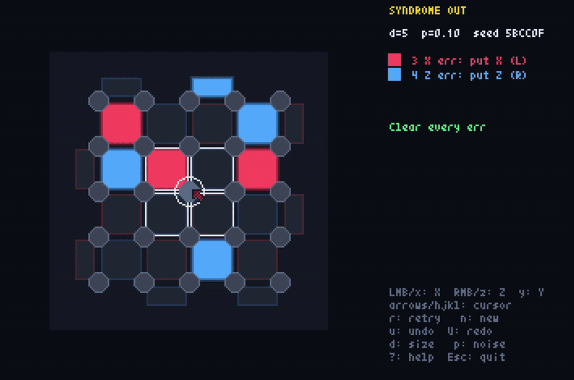
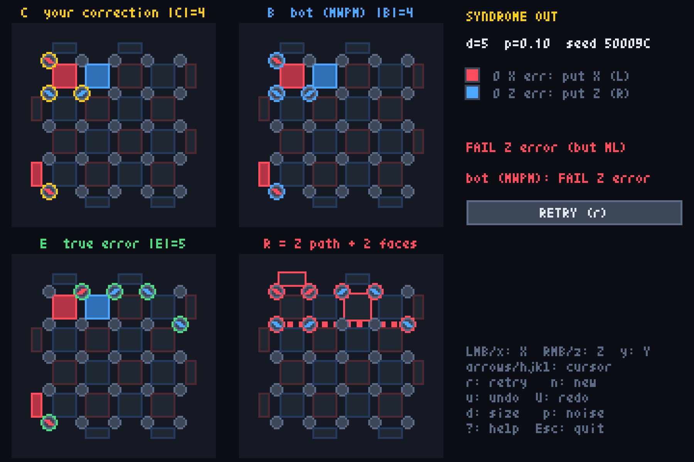
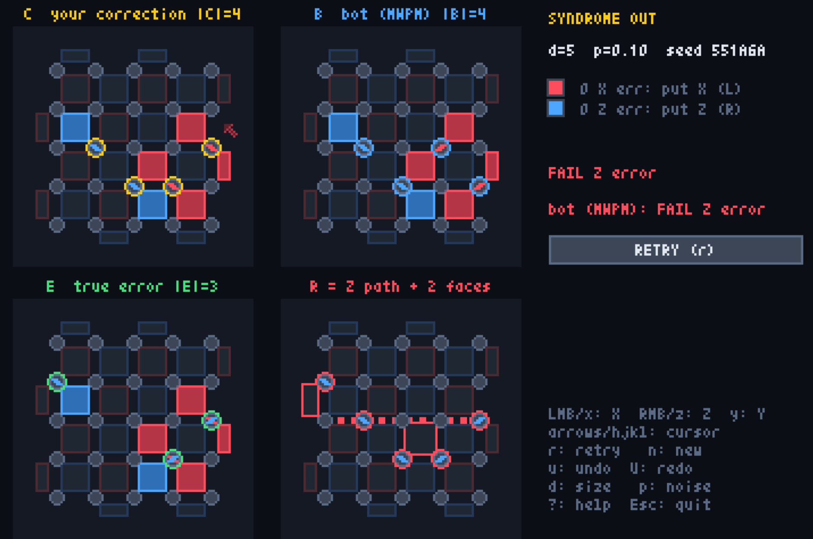

# Syndrome Out



[](https://stn.github.io/SyndromeOut/)

Lights Out for the rotated surface code. Clear every lit stabilizer face by placing
X / Z corrections on data qubits, then find out whether your correction caused a
logical error.

```
uv sync
uv run syndrome-out            # play (d=5, p=0.10 by default)
uv run syndrome-out -d 9 -p 0.15 --seed 42
uv run syndrome-out 80002A         # replay a board: the seed shown in game also fixes d and p
uv run pytest                  # acceptance tests
uv run scripts/threshold_sim.py
```

## Controls

A red tile means an X error sits next to it: clear it with X (red mark). A blue tile means
a Z error: clear it with Z (blue mark). The panel legend shows how many of each are lit.

| Input | Action |
|---|---|
| left click / `x` | toggle X on the qubit under the mouse / cursor |
| right click / `z` | toggle Z |
| `y` | toggle Y (X and Z) |
| arrows / `hjkl` | move the keyboard cursor |
| Enter or JUDGE button | judge (only when every tile is dark) |
| `u` / `U` (or Ctrl+Z / Ctrl+Y) | undo / redo |
| `r` / `n` | retry the same seed / new random seed |
| `d` / `p` | cycle distance 3-5-7-9 / error rate 0.05-0.10-0.15 |
| `?` | help, including the difference from Lights Out |

After judging, the board area splits into a 2x2 grid showing your correction C (yellow),
the bot's correction B (blue), the true error E (green) and the residual R = E*C (red)
side by side. Qubit marks are drawn along the faces they flip. The R board also shows why
the verdict is what it is: on a success it outlines, in green, the faces whose product is R
(a harmless stabilizer); on a failure it draws R, in red, as a string running from one
boundary of the code to the other plus a set of faces.

The verdict also says how your guess compared with the most likely class, i.e. the class
with the largest total probability summed over every error consistent with the syndrome
(degeneracy-aware), which the verdict abbreviates to ML. SUCCESS (but not ML: Z) means you
were right, but the class a logical Z away (likewise X or Y) was likelier, so the same
reasoning would fail on most boards that look like this. FAIL Z error (but ML) means you
picked the most likely class and it was wrong: the board was a losing one, not your
reasoning. A NOT OPTIMAL tag under a success
means a lighter successful correction is known. The bot's line shows how the minimum-weight
correction B fared on the same board.

## Decoder

The bot's correction and the most-likely-class verdict come from pure-Python frontier sweeps
(`syndrome_out/decoder.py`).
Data qubits are visited in row-major order; the DP state is the parity of every stabilizer
face that has been opened but not yet closed, plus the logical class, and a face is checked
against the syndrome when its last qubit is passed.

The bot's correction comes from two sweeps that decode X and Z errors independently, as MWPM
does. At d=9 the frontier holds at most 7 faces, so a sweep touches a few hundred states and
takes about 3 ms.

The most likely class comes from a third sweep that tries I, X, Z and Y on every qubit and tracks
both face types at once. It sums r^|E| over every error consistent with the syndrome, per
class, with r = (p/3)/(1-p) and |E| the support weight, i.e. the actual depolarizing
posterior of the four classes: a Y costs one factor of p/3, not one X plus one Z. Decoding X
and Z independently gets this wrong on a few percent of boards (about 6% at d=5, p=0.10, and
14% at p=0.15); on those the joint sweep picks the right class about three times as often.
The joint frontier is about twice as wide, so this sweep touches a few thousand states and
takes about 0.3 s at d=9, once per board.

`uv sync --extra mwpm` installs PyMatching as a reference. When it is importable the bot's
correction comes from PyMatching instead and the panel says `bot (MWPM)`; the extra also
enables `tests/test_decoder_vs_pymatching.py` and `scripts/threshold_sim.py --decoder pymatching`.

## Packaging

```sh
uv run pyxel package syndrome-out syndrome-out/main.py   # -> syndrome-out.pyxapp
uv run pyxel play syndrome-out.pyxapp                    # player needs pyxel and numpy
uv run pyxel app2exe syndrome-out.pyxapp                 # -> dist/syndrome-out/ (PyInstaller, dev group)
```

The runtime dependencies are just pyxel and numpy, so the `.pyxapp` runs anywhere with
`pip install pyxel numpy`, and the exe folder is about 64 MB.

As a bonus, both dependencies exist in Pyodide, so the same code also runs in a browser:
`uv run scripts/build_web.py` writes `dist/web/index.html` (via `pyxel app2html`, plus numpy
in the page's package list; Pyxel, Pyodide and numpy are fetched from CDNs at load time).
Try it with `python -m http.server -d dist/web`.

## Zero syndrome, wrong class

The whole point of the game is that clearing the board is not the same as succeeding.
A reproducible example: [50009C](https://stn.github.io/SyndromeOut/50009C).
The minimum-weight correction (what the bot plays; weight 4) turns every tile off and still produces a logical Z error.
The residual E*C lights nothing because it is a string of Z's running from one side of the code to the other,
times a few faces, and such a string is a logical Z. It is also the most likely class, so the verdict reads
FAIL Z error (but ML).
Playing the true error itself (weight 5) gives SUCCESS (but not ML: Z): it lies in
the class whose total probability is about 95 times smaller. On this board the best guess and the actual error disagree.



The opposite case is [551A6A](https://stn.github.io/SyndromeOut/551A6A): the true error is Z, Y, Y (weight 3), the bot plays a weight-4
correction and fails, and the true class is the most likely one, so playing the true error is
a plain SUCCESS. A decoder that treats the X and Z parts independently would count each Y
twice and call the bot's class likelier.



Licensed under the MIT License. See [LICENSE](LICENSE).
